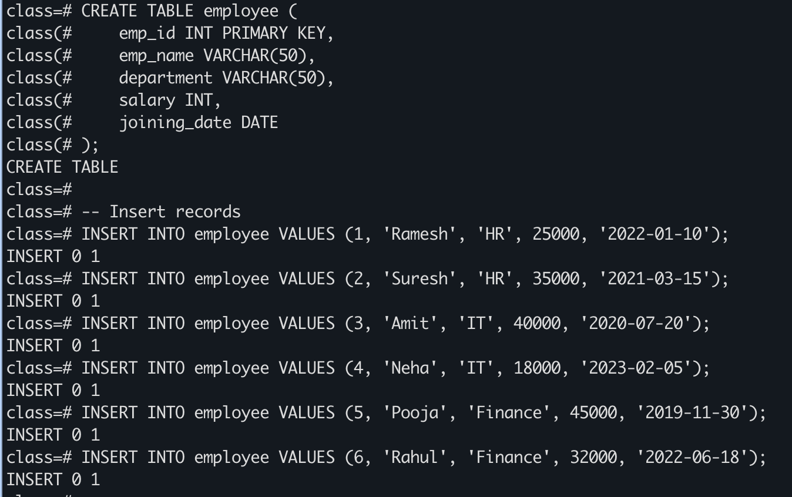
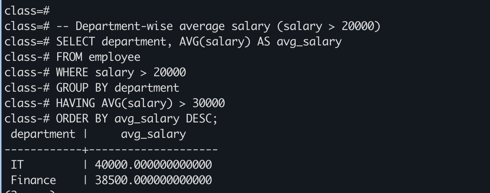

# Experiment 2 – SQL SELECT Queries using WHERE, GROUP BY, HAVING, ORDER BY

## Experiment
**Experiment 1.2:** Understanding and implementing SQL SELECT queries using WHERE, GROUP BY, HAVING, and ORDER BY clauses in PostgreSQL to analyze employee data.

---

## Aim
To practice writing SQL SELECT statements to filter, group, sort, and calculate aggregate values for meaningful analysis of employee data.

---

## Objective
- To practice writing SQL SELECT statements.
- To filter records using the WHERE clause.
- To group records using the GROUP BY clause.
- To filter grouped data using the HAVING clause.
- To sort query results using ORDER BY.
- To calculate average salary using the AVG() function.

---

## Software Requirements
**Database:** PostgreSQL  
**Tool:** pgAdmin or psql  

---

## Practical / Experiment Steps
1. Create the EMPLOYEE table.
2. Insert records into the EMPLOYEE table.
3. Display all records from the table.
4. Display department name and average salary of employees for each department.
5. Consider only employees with salary > 20000.
6. Display only departments where average salary > 30000.
7. Arrange the final output in descending order of average salary.

---

## Input / Output Details

### Input
- EMPLOYEE table with columns: emp_id, emp_name, department, salary, joining_date.
- SQL SELECT queries using WHERE, GROUP BY, HAVING, ORDER BY, and AVG().

### Output
- Step 1: EMPLOYEE table created and records inserted.
- Step 2: Display all records.
- Step 3: Department-wise average salary.
- Step 4: Final query with WHERE, GROUP BY, HAVING, ORDER BY.

---

## SQL Queries

```sql
CREATE TABLE employee (
    emp_id INT PRIMARY KEY,
    emp_name VARCHAR(50),
    department VARCHAR(50),
    salary INT,
    joining_date DATE
);

INSERT INTO employee VALUES (1, 'Ramesh', 'HR', 25000, '2022-01-10');
INSERT INTO employee VALUES (2, 'Suresh', 'HR', 35000, '2021-03-15');
INSERT INTO employee VALUES (3, 'Amit', 'IT', 40000, '2020-07-20');
INSERT INTO employee VALUES (4, 'Neha', 'IT', 18000, '2023-02-05');
INSERT INTO employee VALUES (5, 'Pooja', 'Finance', 45000, '2019-11-30');
INSERT INTO employee VALUES (6, 'Rahul', 'Finance', 32000, '2022-06-18');

SELECT * FROM employee;

SELECT department, AVG(salary) AS avg_salary
FROM employee
GROUP BY department;

SELECT department, AVG(salary) AS avg_salary
FROM employee
WHERE salary > 20000
GROUP BY department;

SELECT department, AVG(salary) AS avg_salary
FROM employee
GROUP BY department
HAVING AVG(salary) > 30000;

SELECT department, AVG(salary) AS avg_salary
FROM employee
WHERE salary > 20000
GROUP BY department
HAVING AVG(salary) > 30000
ORDER BY avg_salary DESC;
```

---

## Screenshots

### Step 1: Table Creation and Insertion


---

### Step 2: Display All Records


---

### Step 3: Department-wise Average Salary


---

### Step 4: Final Query with WHERE, GROUP BY, HAVING, ORDER BY


---

## Learning Outcome
- Learned to create and manipulate tables in PostgreSQL.
- Learned to use SELECT queries for data retrieval.
- Learned to filter records using WHERE.
- Learned to group data using GROUP BY.
- Learned to filter grouped data using HAVING.
- Learned to sort query results using ORDER BY.
- Learned to use aggregate functions like AVG() for data analysis.
