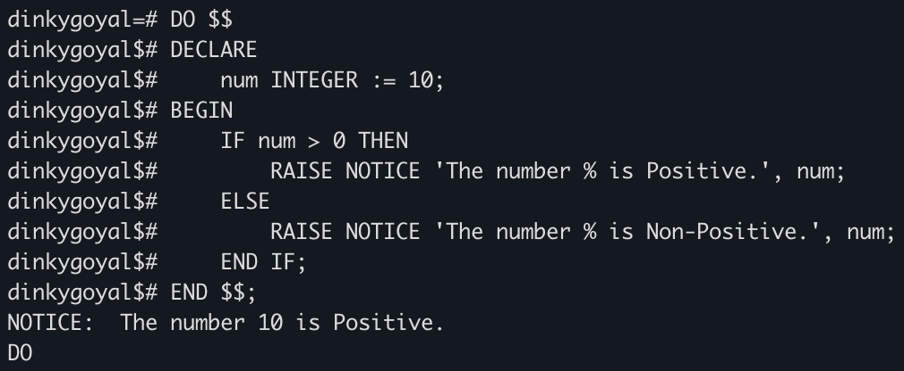
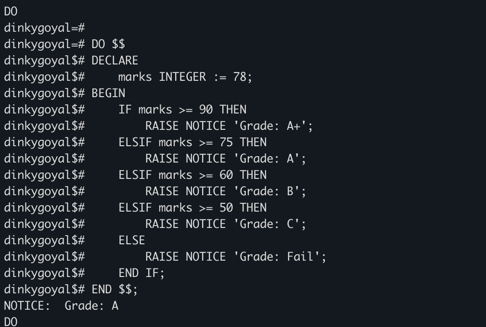
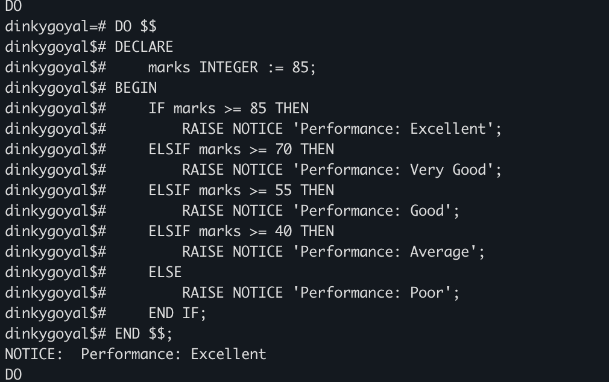
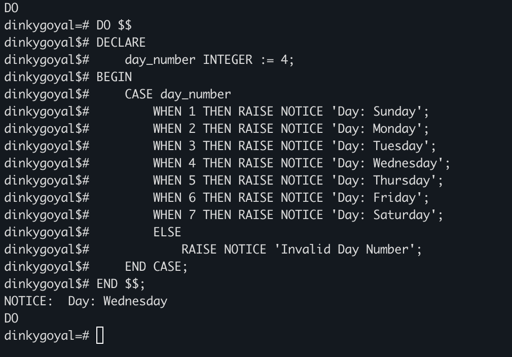

# Experiment 4

**Student Name:** Sahil Goyal  
**UID:** 24BDA70148  
**Branch:** CSE  
**Section/Group:** AIT-KRG-GP2  
**Semester:** 4th  
**Date of Performance:** 30/01/26  
**Subject Name:** DBMS  

---

## Aim of the Practical

To understand and implement conditional control structures in PL/pgSQL using IF–ELSE, ELSIF, ELSIF ladder, and CASE statements in PostgreSQL to control the flow of execution and demonstrate decision-making capabilities.

---

## Tool Used

**Database Management System:** PostgreSQL  
**Interface Used:** psql (iTerm2 Terminal)

---

## Objective

To implement control structures in PL/pgSQL including:

- IF–ELSE  
- IF–ELSIF–ELSE  
- ELSIF Ladder  
- CASE Statement  

---

## Practical / Experimental Steps

1. Open iTerm2 terminal.
2. Connect to PostgreSQL using:

   ```bash
   psql -U postgres -d database_name
   ```

3. Execute PL/pgSQL DO blocks using conditional statements.
4. Modify input values and re-execute to test different conditions.
5. Observe and record the outputs.

---

# I / O Analysis

---

## 1. IF–ELSE Statement

-- This program checks whether a number is positive or non-positive.

```sql
DO $$
DECLARE
    num INTEGER := -5;
BEGIN
    IF num > 0 THEN
        RAISE NOTICE 'The number % is Positive.', num;
    ELSE
        RAISE NOTICE 'The number % is Non-Positive.', num;
    END IF;
END $$;
```

### Output



---

## 2. IF–ELSIF–ELSE Statement

-- This program evaluates the grade of a student based on marks.

```sql
DO $$
DECLARE
    marks INTEGER := 85;
BEGIN
    IF marks >= 90 THEN
        RAISE NOTICE 'Grade: A+';
    ELSIF marks >= 75 THEN
        RAISE NOTICE 'Grade: A';
    ELSIF marks >= 60 THEN
        RAISE NOTICE 'Grade: B';
    ELSIF marks >= 50 THEN
        RAISE NOTICE 'Grade: C';
    ELSE
        RAISE NOTICE 'Grade: Fail';
    END IF;
END $$;
```

### Output



---

## 3. ELSIF Ladder

-- This program determines performance status based on marks.

```sql
DO $$
DECLARE
    marks INTEGER := 72;
BEGIN
    IF marks >= 85 THEN
        RAISE NOTICE 'Performance: Excellent';
    ELSIF marks >= 70 THEN
        RAISE NOTICE 'Performance: Very Good';
    ELSIF marks >= 55 THEN
        RAISE NOTICE 'Performance: Good';
    ELSIF marks >= 40 THEN
        RAISE NOTICE 'Performance: Average';
    ELSE
        RAISE NOTICE 'Performance: Poor';
    END IF;
END $$;
```

### Output



---

## 4. CASE Statement

-- This program displays the day name based on the given day number.

```sql
DO $$
DECLARE
    day_number INTEGER := 4;
BEGIN
    CASE day_number
        WHEN 1 THEN RAISE NOTICE 'Day: Sunday';
        WHEN 2 THEN RAISE NOTICE 'Day: Monday';
        WHEN 3 THEN RAISE NOTICE 'Day: Tuesday';
        WHEN 4 THEN RAISE NOTICE 'Day: Wednesday';
        WHEN 5 THEN RAISE NOTICE 'Day: Thursday';
        WHEN 6 THEN RAISE NOTICE 'Day: Friday';
        WHEN 7 THEN RAISE NOTICE 'Day: Saturday';
        ELSE
            RAISE NOTICE 'Invalid Day Number';
    END CASE;
END $$;
```

### Output



---

## Learning Outcomes

- Understood the structure of a PL/pgSQL block using `DO $$ DECLARE BEGIN END $$`.
- Learned how to declare and initialize variables in PostgreSQL.
- Gained knowledge of using `RAISE NOTICE` to display output.
- Implemented decision-making using IF–ELSE and ELSIF ladder.
- Understood how CASE statement simplifies multiple condition checking.
- Developed understanding of controlling execution flow in PostgreSQL programs.

---
