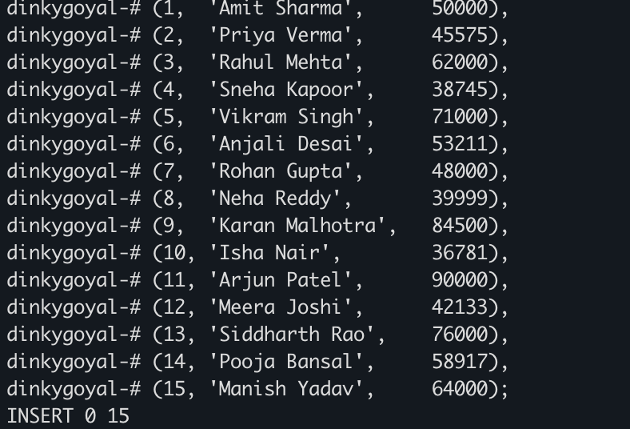
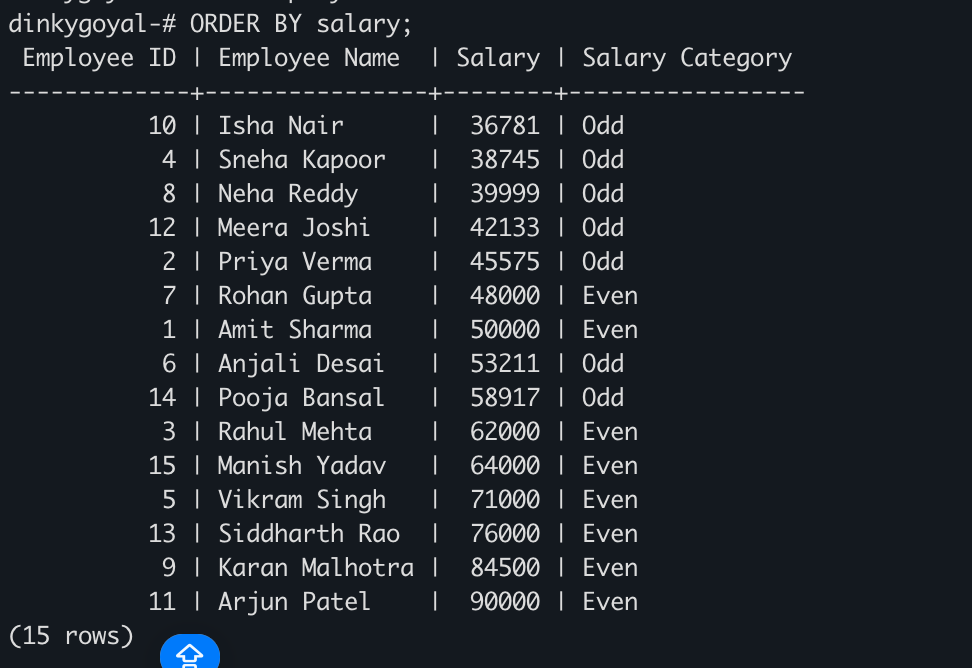

# DBMS Experiment 5 – SQL Conditional Logic (Odd & Even Salaries)

## Student Details

**Student Name:** Sahil Goyal  
**UID:** 24BDA70148  
**Branch:** CSE  
**Section/Group:** AIT-KRG-GP2  
**Semester:** 4th  
**Date of Performance:** 27/02/26  
**Subject Name:** DBMS  

---

# Aim of the Practical

To understand and apply conditional logic in SQL by using the modulus operator (**MOD / %**) to analyze numerical data and classify employee salaries as **odd or even**, thereby improving data analysis and decision-making skills in SQL.

---

# Tool Used

### Database Management System
- PostgreSQL

### Database Administration Tool
- pgAdmin / psql (iTerm2 Terminal)

---

# Objective

To write and execute SQL queries that use the **MOD() function** to check employee salaries and classify them as **odd or even values** from an employee table.

---

# Practical / Experimental Steps

1. Open **pgAdmin** and connect to the PostgreSQL server.  
2. Create the **Employee table** with required attributes.  
3. Insert multiple records into the Employee table.  
4. Write a **SELECT query using CASE statement and MOD() function** to classify salaries as odd or even.  
5. Execute the query and observe the output.  
6. Verify the correctness of the results.

---

# I / O Analysis

## 1️⃣ Table Creation

### Program

```sql
CREATE TABLE Employee(
    emp_id INT PRIMARY KEY,
    name VARCHAR(50) NOT NULL,
    salary INT NOT NULL
);
```
### Output

Table **Employee** created successfully.

---

## 2️⃣ Insert Records

### Screenshot

The following screenshot shows the records successfully inserted into the **Employee** table.



---

## 3️⃣ Display Odd and Even Salaries

### Program

```sql
SELECT
    emp_id AS "Employee ID",
    name AS "Employee Name",
    salary AS "Salary",
    CASE
        WHEN MOD(salary,2) = 0 THEN 'Even'
        ELSE 'Odd'
    END AS "Salary Category"
FROM Employee
ORDER BY salary;
```
### Output

The query displays employee details along with the **salary classification as Even or Odd** using the `MOD()` function and `CASE` statement.

### Screenshot



---

# Learning Outcomes

- Understood how to **create tables in PostgreSQL**.
- Learned how to **insert multiple records into a database table**.
- Gained knowledge of using the **MOD() function to determine odd and even values**.
- Learned to apply **conditional logic using CASE statements** in SQL queries.
- Developed the ability to **classify and analyze salary data directly in SQL**.
- Improved understanding of **SQL-based data analysis and decision-making techniques**.

---

# Repository Structure
