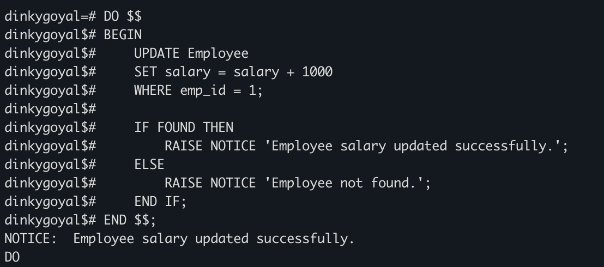
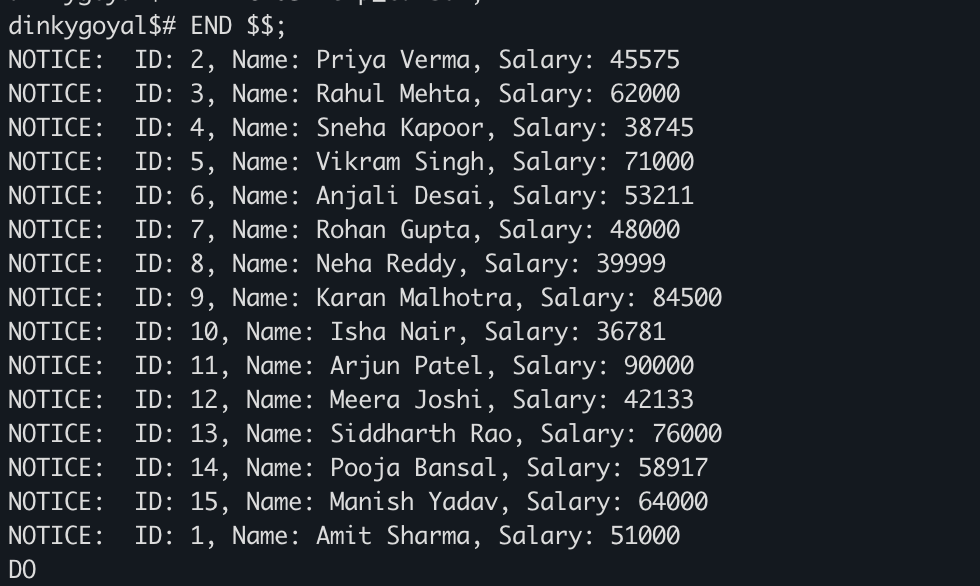
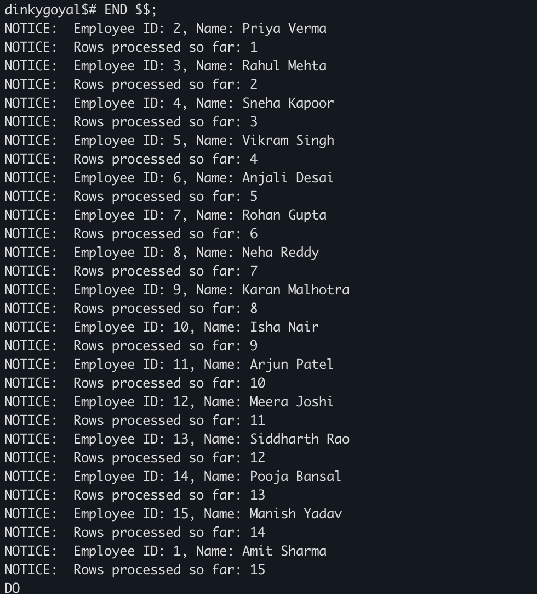

# DBMS Experiment 6 – Cursor Based Row Processing in PL/pgSQL

## Student Details

**Student Name:** Sahil Goyal  
**UID:** 24BDA70148  
**Branch:** CSE  
**Section/Group:** AIT-KRG-GP2  
**Semester:** 4th  
**Date of Performance:** 27/02/26  
**Subject Name:** DBMS  

---

# Experiment

**Experiment 6:** Implementing implicit cursors, explicit cursors, and cursor attributes in **PL/pgSQL** to process employee records row by row.

This experiment demonstrates how **PostgreSQL handles query results internally** and how programmers can manually control **row-by-row processing using cursors**.

---

# Aim

To understand and implement **cursors in PL/pgSQL** for processing multiple rows from a database table **one record at a time**.

---

# Objective

- To understand the concept of **cursors in PostgreSQL**
- To implement **implicit cursors** for DML operations
- To implement **explicit cursors** to fetch multiple records from a table
- To use cursor attributes such as **FOUND**, **NOT FOUND**, and row counters
- To process and display employee records using **RAISE NOTICE**

---

# Software Requirements

### Database
PostgreSQL

### Tool
iTerm2 / psql

---

# Practical / Experiment Steps

1. Create an **Employee table** and insert sample records.  
2. Write a **PL/pgSQL block** to demonstrate implicit cursor behavior using an **UPDATE** statement.  
3. Declare and use an **explicit cursor** to fetch employee records one by one.  
4. Use a **loop structure** to process each row retrieved from the cursor.  
5. Apply **cursor attributes** to control loop execution and count processed rows.  
6. Display employee details using **RAISE NOTICE**.  
7. Capture screenshots of the outputs for documentation.

---

# Input / Output Details

## Input

Employee table fields:

- `emp_id INT`
- `name VARCHAR(50)`
- `salary INT`

Operations performed:

- Updating employee salary
- Fetching employee records using cursors
- Counting processed rows

---

## Output

**Step 1:** Display message indicating whether employee salary update was successful.  

**Step 2:** Display employee details fetched using an explicit cursor.  

**Step 3:** Display employee ID, name, and number of rows processed using cursor attributes.

---

# SQL / PLpgSQL Code

## 1️⃣ Implicit Cursor

```sql
DO $$
BEGIN
    UPDATE Employee
    SET salary = salary + 1000
    WHERE emp_id = 1;

    IF FOUND THEN
        RAISE NOTICE 'Employee salary updated successfully.';
    ELSE
        RAISE NOTICE 'Employee not found.';
    END IF;
END $$          
```
---

## 2️⃣ Explicit Cursor

```sql
DO $$
DECLARE
    emp_cursor CURSOR FOR
        SELECT emp_id, name, salary FROM Employee;

    emp_record RECORD;

BEGIN
    OPEN emp_cursor;

    LOOP
        FETCH emp_cursor INTO emp_record;
        EXIT WHEN NOT FOUND;

        RAISE NOTICE 'Employee ID: %, Name: %, Salary: %',
        emp_record.emp_id,
        emp_record.name,
        emp_record.salary;

    END LOOP;

    CLOSE emp_cursor;
END $$;
```

---

## 3️⃣ Cursor Attribute

```sql
DO $$
DECLARE
    emp_cursor CURSOR FOR
        SELECT emp_id, name FROM Employee;

    emp_record RECORD;
    row_counter INT := 0;

BEGIN
    OPEN emp_cursor;

    LOOP
        FETCH emp_cursor INTO emp_record;
        EXIT WHEN NOT FOUND;

        row_counter := row_counter + 1;

        RAISE NOTICE 'Employee ID: %, Name: %',
        emp_record.emp_id,
        emp_record.name;

        RAISE NOTICE 'Rows processed so far: %', row_counter;

    END LOOP;

    CLOSE emp_cursor;
END $$;
```

---

# Screenshots

### Screenshot 1 – Execution of Implicit Cursor Program



---

### Screenshot 2 – Output Displaying Employee Records Using Explicit Cursor



---

### Screenshot 3 – Output Showing Employee Details with Rows Processed Using Cursor Attributes



---

# Learning Outcome

- Learned the concept and importance of cursors in **PL/pgSQL**
- Understood the difference between **implicit and explicit cursors**
- Learned how to **fetch records one by one from a table**
- Learned how to use **cursor attributes such as FOUND and NOT FOUND**
- Gained practical knowledge of **row-by-row data processing in PostgreSQL**