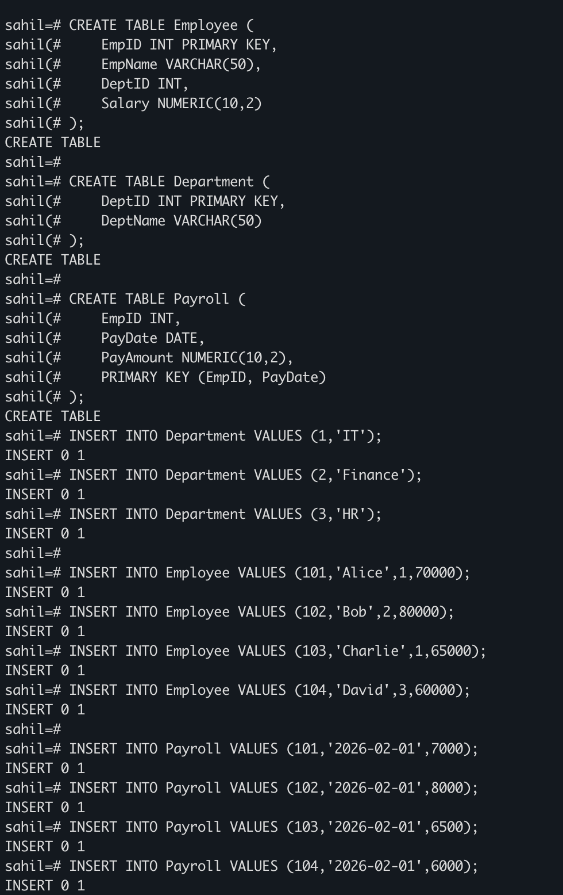
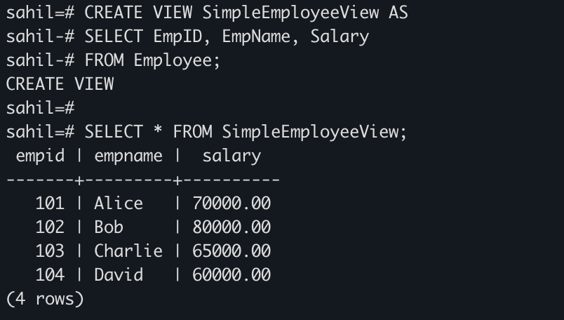
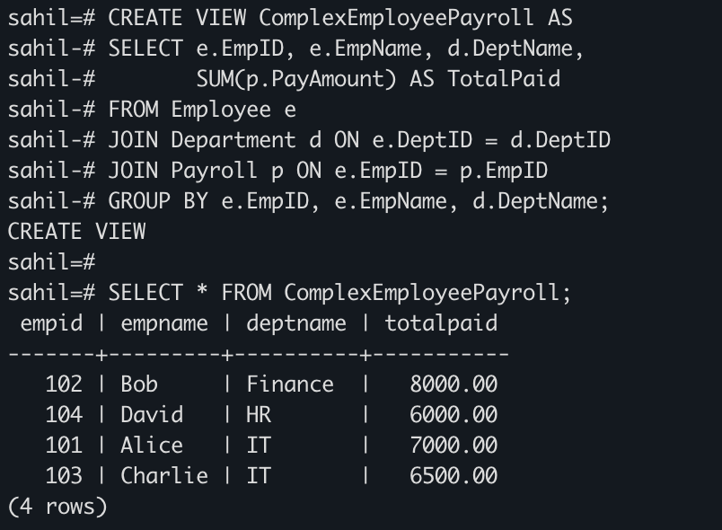
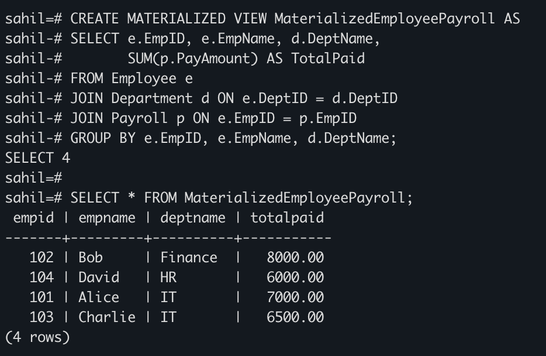
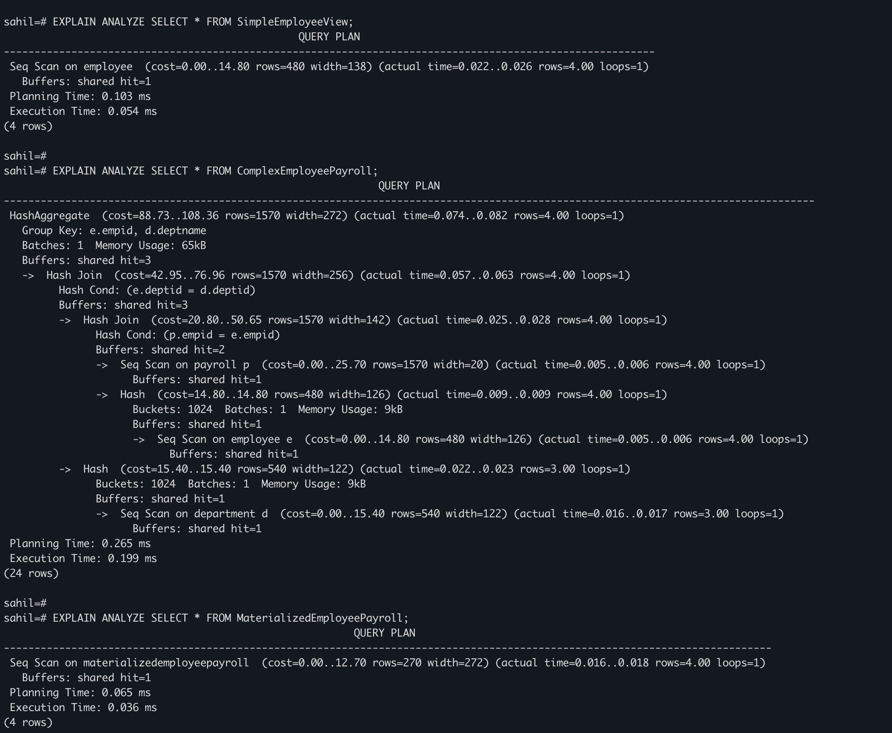

# DBMS Experiment 7 – Design and Performance Analysis of Materialized Views in PostgreSQL

## Student Details

**Student Name:** Sahil Goyal  
**UID:** 24BDA70148  
**Branch:** CSE  
**Section/Group:** AIT-KRG-GP2  
**Semester:** 4th  
**Date of Performance:** 27/02/26  
**Subject Name:** DBMS  

---

# Experiment

**Experiment 7:** Design and Performance Analysis of Simple Views, Complex Views, and Materialized Views in PostgreSQL.

This experiment demonstrates how database views and materialized views work and compares their performance using query execution analysis.

---

# Aim

To design and implement simple views, complex views, and materialized views and analyze their performance differences.

---

# Objective

- To create a **simple view** based on a single table.
- To create a **complex view** using joins and aggregation.
- To create a **materialized view** that stores precomputed results.
- To analyze and compare **query execution time** using EXPLAIN ANALYZE.
- To understand how **materialized views improve query performance**.

---

# Software Requirements

Database: PostgreSQL  

Tool: iTerm2 / psql

---

# Practical / Experiment Steps

1. Create tables for **Employee, Department, and Payroll**.
2. Insert sample records into the tables.
3. Create a **Simple View** using a single table.
4. Create a **Complex View** using joins and aggregation.
5. Create a **Materialized View** to store computed results.
6. Query each view to observe the output.
7. Use **EXPLAIN ANALYZE** to compare performance.

---

# Input / Output Details

## Input

Tables Used:

Employee Table  
- emp_id INT  
- name VARCHAR  
- department_id INT  
- salary INT  

Department Table  
- dept_id INT  
- dept_name VARCHAR  

Payroll Table  
- emp_id INT  
- pay_date DATE  
- pay_amount INT  

Operations Performed:

- Creating simple view
- Creating complex view
- Creating materialized view
- Query performance comparison

---

## Output

Step 1: Tables created and sample data inserted.

Step 2: Simple view displaying employee information.

Step 3: Complex view displaying employee payroll summary with department details.

Step 4: Materialized view storing precomputed payroll data.

Step 5: Execution time comparison using EXPLAIN ANALYZE.

---

# SQL / PostgreSQL Code

## Step 1 – Creating Tables

```sql
CREATE TABLE Employee (
    emp_id INT PRIMARY KEY,
    name VARCHAR(50),
    dept_id INT,
    salary INT
);

CREATE TABLE Department (
    dept_id INT PRIMARY KEY,
    dept_name VARCHAR(50)
);

CREATE TABLE Payroll (
    emp_id INT,
    pay_date DATE,
    pay_amount INT
);
```
## Step 2 – Inserting Sample Data

```sql
INSERT INTO Department VALUES
(1,'IT'),
(2,'Finance'),
(3,'HR');

INSERT INTO Employee VALUES
(101,'Alice',1,70000),
(102,'Bob',2,80000),
(103,'Charlie',1,65000),
(104,'David',3,60000);

INSERT INTO Payroll VALUES
(101,'2026-02-01',7000),
(102,'2026-02-01',8000),
(103,'2026-02-01',6500),
(104,'2026-02-01',6000);
```
---

## Step 3 - Simple View

```sql 
CREATE VIEW simple_employee_view AS
SELECT emp_id, name, salary
FROM Employee;
SELECT * FROM simple_employee_view;
```
---
## Step 4 – Complex View

```sql
CREATE VIEW complex_employee_payroll AS
SELECT e.emp_id,
       e.name,
       d.dept_name,
       SUM(p.pay_amount) AS total_paid
FROM Employee e
JOIN Department d ON e.dept_id = d.dept_id
JOIN Payroll p ON e.emp_id = p.emp_id
GROUP BY e.emp_id, e.name, d.dept_name;

SELECT * FROM complex_employee_payroll;
```
---

## Step 5 – Materialized View
```sql
CREATE MATERIALIZED VIEW materialized_employee_payroll AS
SELECT e.emp_id,
       e.name,
       d.dept_name,
       SUM(p.pay_amount) AS total_paid
FROM Employee e
JOIN Department d ON e.dept_id = d.dept_id
JOIN Payroll p ON e.emp_id = p.emp_id
GROUP BY e.emp_id, e.name, d.dept_name;

SELECT * FROM materialized_employee_payroll;

Refresh Materialized View

REFRESH MATERIALIZED VIEW materialized_employee_payroll;
```
---

## Step 6 – Performance Analysis
```sql
EXPLAIN ANALYZE SELECT * FROM simple_employee_view;

EXPLAIN ANALYZE SELECT * FROM complex_employee_payroll;

EXPLAIN ANALYZE SELECT * FROM materialized_employee_payroll;
```
---

# Screenshots

### Screenshot 1 – Data Insertion


### Screenshot 2 – Simple View Output


### Screenshot 3 – Complex View Output


### Screenshot 4 – Materialized View Output


### Screenshot 5 – Performance Comparison


# Learning Outcome
- Learned the concept of views in PostgreSQL.
- Understood the difference between simple views, complex views, and materialized views.
- Learned how to create views using joins and aggregation functions.
- Understood how materialized views store precomputed results.
- Learned how to use EXPLAIN ANALYZE to compare query performance.
- Gained practical understanding of query optimization techniques used in enterprise systems.