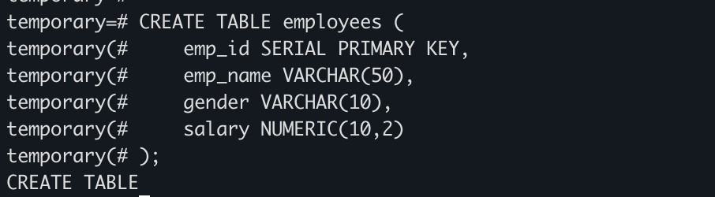
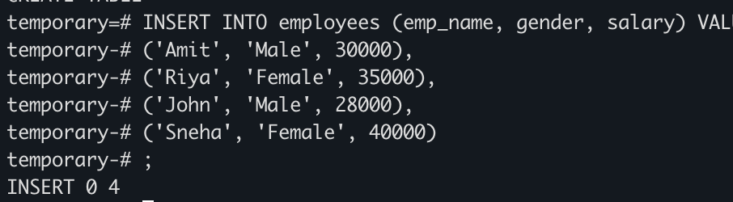
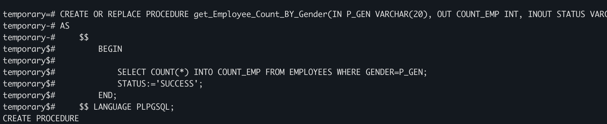
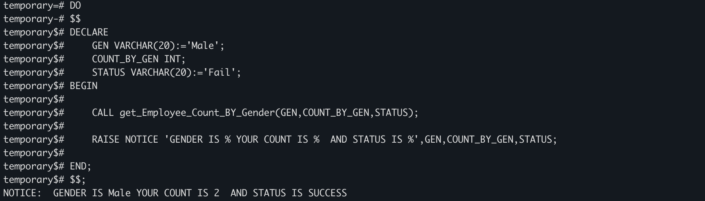
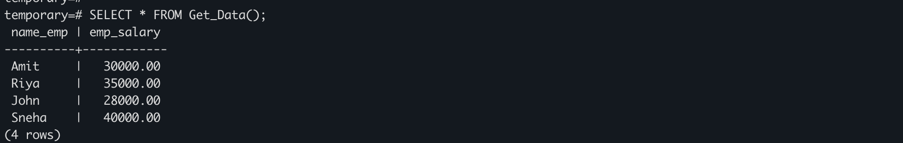

# Practical Worksheet — Stored Procedures and Functions in PostgreSQL

## 1. Aim of the Practical
To create and execute a stored procedure that retrieves employee data based on gender using input parameters, demonstrating the use of procedures, functions, IN/OUT parameters, and procedural logic in PostgreSQL.

---

## 2. Tool Used
- **Database Management System:** PostgreSQL
- **Database Administration Tool:** pgAdmin

---

## 3. Objective
To write and execute a PL/SQL stored procedure that dynamically accepts gender as an argument and computes the employee count corresponding to the given gender. Also to create a function that returns a table of employee data.

---

## 4. Practical / Experimental Steps
- Step 1: Create the base table `employees` with attributes `emp_id`, `emp_name`, `gender`, and `salary`.
- Step 2: Insert sample records into the `employees` table to simulate real-world employee data.
- Step 3: Define and create a stored procedure `get_Employee_Count_BY_Gender` that accepts gender as an IN parameter, returns count as an OUT parameter, and uses an INOUT status parameter.
- Step 4: Implement logic inside the procedure to count employees matching the given gender using a `SELECT COUNT(*)` query.
- Step 5: Execute the stored procedure using a DO block with dynamically declared variables.
- Step 6: Display the output using `RAISE NOTICE` to show gender, employee count, and status.
- Step 7: Create a function `Get_Data()` that returns a table of employee names and salaries using `RETURN QUERY`.
- Step 8: Execute the function using `SELECT * FROM Get_Data()` and verify the output.

---

## 5. I/O Analysis

### 5.1 Create Table
```sql
CREATE TABLE employees (
    emp_id SERIAL PRIMARY KEY,
    emp_name VARCHAR(50),
    gender VARCHAR(10),
    salary NUMERIC(10,2)
);
```



---

### 5.2 Insert Sample Data
```sql
INSERT INTO employees (emp_name, gender, salary) VALUES
('Amit', 'Male', 30000),
('Riya', 'Female', 35000),
('John', 'Male', 28000),
('Sneha', 'Female', 40000);
```



---

### 5.3 Stored Procedure — get_Employee_Count_BY_Gender
```sql
CREATE OR REPLACE PROCEDURE get_Employee_Count_BY_Gender(IN P_GEN VARCHAR(20), OUT COUNT_EMP INT, INOUT STATUS VARCHAR)
AS
	$$
		BEGIN
			SELECT COUNT(*) INTO COUNT_EMP FROM EMPLOYEES WHERE GENDER=P_GEN;
			STATUS:='SUCCESS';
        END;
	$$ LANGUAGE PLPGSQL;
```



---

### 5.4 Execute Procedure using DO Block
```sql
DO
$$
DECLARE
	GEN VARCHAR(20):='Male';
	COUNT_BY_GEN INT;
	STATUS VARCHAR(20):='Fail';
BEGIN
	CALL get_Employee_Count_BY_Gender(GEN,COUNT_BY_GEN,STATUS);
	RAISE NOTICE 'GENDER IS % YOUR COUNT IS %  AND STATUS IS %',GEN,COUNT_BY_GEN,STATUS;
END;
$$;
```



---

### 5.5 Function — Get_Data()
```sql
CREATE OR REPLACE FUNCTION Get_Data()
RETURNS TABLE(name_emp VARCHAR(10), emp_salary NUMERIC(10,2))
AS
	$$
	BEGIN
	RETURN QUERY SELECT emp_name, salary FROM employees;
	END;
	$$ LANGUAGE PLPGSQL;

SELECT * FROM Get_Data();
```



---

## 6. Learning Outcomes
- Understood the structure and syntax of stored procedures in PostgreSQL using PL/pgSQL.
- Learned how to use IN, OUT, and INOUT parameters in procedures.
- Practiced passing dynamic input values to procedures using a DO block and CALL statement.
- Applied aggregate functions like `COUNT(*)` inside procedural logic for data analysis.
- Learned how to create functions that return tables using `RETURNS TABLE` and `RETURN QUERY`.
- Developed reusable database logic that can be applied in real-world business scenarios.